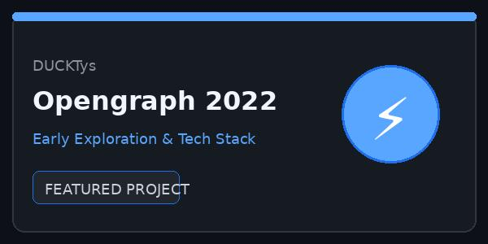
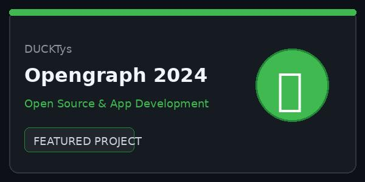
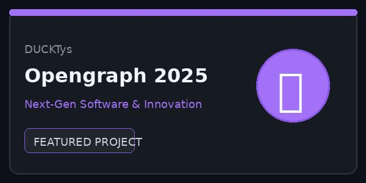

# こんにちは Hello 🐱

  

  

---

### 💡 Tip

I build open-source applications and software solutions focused on usability, clean code, and expressive interfaces. For collaboration or inquiries, feel free to contact me or check my repositories!

---

### 🛠️ 使用している言語とフレームワーク Languages & Frameworks I use

  
  
  
  
  
  
  
  

---

### 🔗 公開プロジェクト Public projects shared

Full list open sourced in [https://github.com/DUCKTys?tab=repositories](https://github.com/DUCKTys?tab=repositories)

<table align="center">
  <tr>
    <th align="center">Opengraph 2022</th>
    <th align="center">Opengraph 2024</th>
    <th align="center">Opengraph 2025</th>
  </tr>
  <tr>
    <td align="center">
      
    </td>
    <td align="center">
      
    </td>
    <td align="center">
      
    </td>
  </tr>
</table>

---

### 📌 注目のプロジェクト Highlights

<table align="center">
  <tr>
    <th>Projects</th>
    <th>Stars</th>
    <th>Forks</th>
  </tr>
  <tr>
    <td>
      **[DUCKTys Profile](https://github.com/DUCKTys/DUCKTys)**: 🦆 Personal GitHub README profile dashboard with dynamic stats and project showcases.
    </td>
    <td>
      
    </td>
    <td>
      
    </td>
  </tr>
  <tr>
    <td>
      **[Featured Project](https://github.com/DUCKTys?tab=repositories)**: 🚀 Check out my latest repositories and open-source contributions.
    </td>
    <td>
      
    </td>
    <td>
      
    </td>
  </tr>
</table>

---

  <i>"Keep building and stay curious!"</i> 🚀

